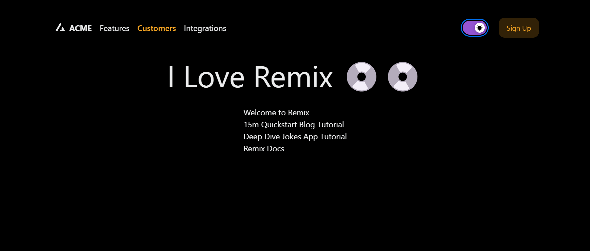

# NextUI library example

  This is an example of remix application built using remix nextui and tailwind css

  ## Preview

Open this example on [CodeSandbox](https://codesandbox.com):

## Important files
- tailwind.config.ts
- app/tailwind.css
- app/theme/provider.tsx

## Related links
- [nextui docs](https://nextui.org/docs/guide/introduction)
- [Install Tailwind CSS with Remix](https://tailwindcss.com/docs/guides/remix)
- [remix docs](https://remix.run/docs/en/main)

