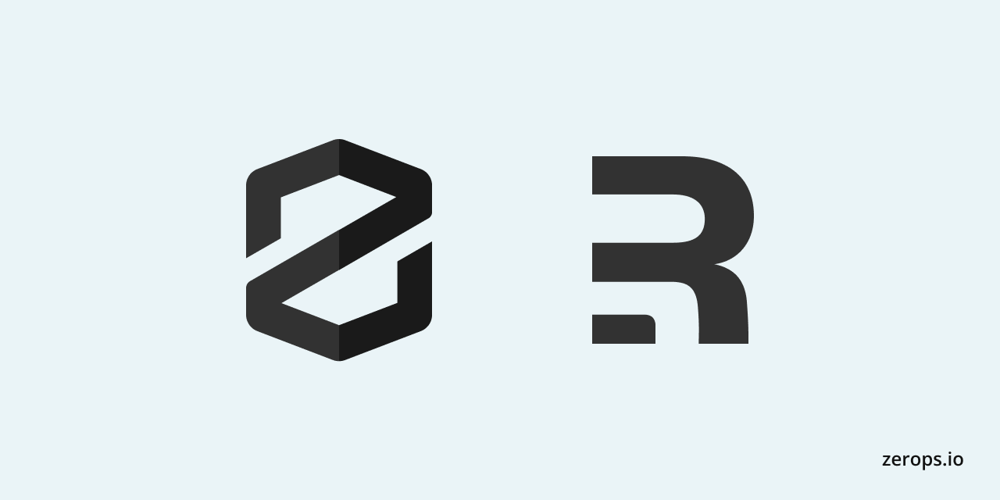

# Zerops + Remix - Nodejs - [Preview](https://remixrun.zerops.dev/)



A nodejs Remix example for Zerops which you can deploy in 2 simple steps.

## Instructions to Deploy on Zerops

1. Navigate to the Zerops Dashboard and locate the import project button on the sidebar.

2. Paste the Project Yaml

```yaml
project:
  name: zerops-remix

services:
  - hostname: remixnode
    type: nodejs@18
    buildFromGit: https://github.com/fxck/zerops-remix-nodejs
    ports:
      - port: 3000
        httpSupport: true
    enableSubdomainAccess: true
    minContainers: 1
```

If you still find yourself stuck in the process join our [Discord community](https://discord.gg/5ptAqtpyvh).
